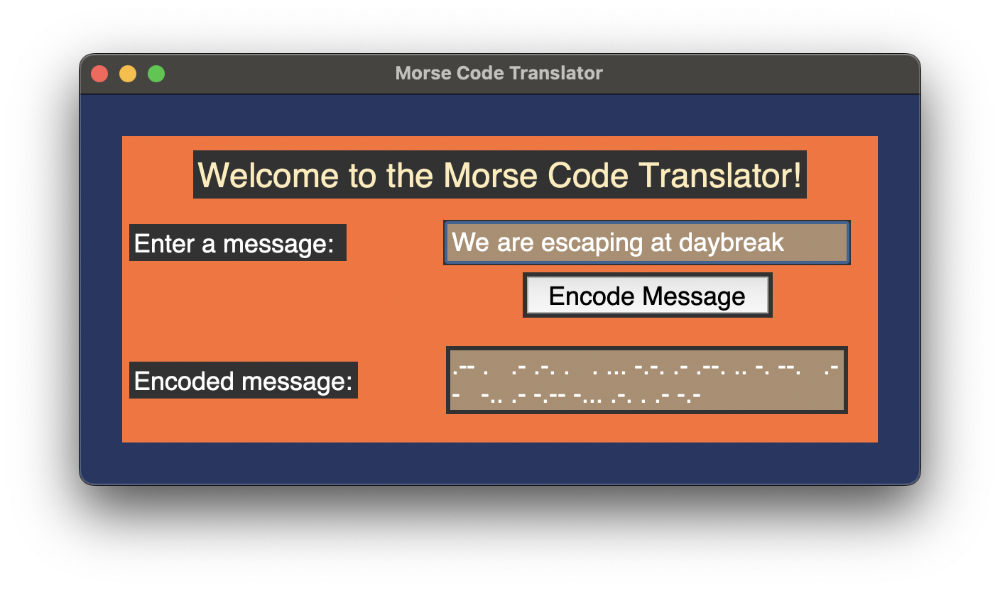

# # Morse Code Translator
This code is a Morse Code Translator program written in Python using the Tkinter library. It creates a window
object, configures the window size and title, and then creates a frame, label, input field, button, and a text
field for output to the user. 

The program contains a dictionary for all the Morse Code elements, and the encode_morse function takes in the user's input message and then encodes it using the morse_code
dictionary. The function then deletes any existing output text in the fixed text field and inserts the encoded
message into it. 

Finally, the enc_button is bound to the encode_morse function so once clicked it will return the
encoded message to the user.

## Requirements
* Python
* Tkinter

## Usage
Run the code with the following command: 
`main.py`

## Features
* Create a window object
* Configure the window size
* Create a frame, label, input field, button, and a text field for output to the user
* Dictionary of Morse Code elements
* `encode_morse` function which takes in the user's input message and encodes it using the specified dictionary
* The `encode_morse` function deletes any existing output text and inserts the encoded message into the output field
* `enc_button` is bound to the `encode_morse` function so when clicked it will return the encoded message to the user

## Credits
This code was written by [Kal Bartal]

